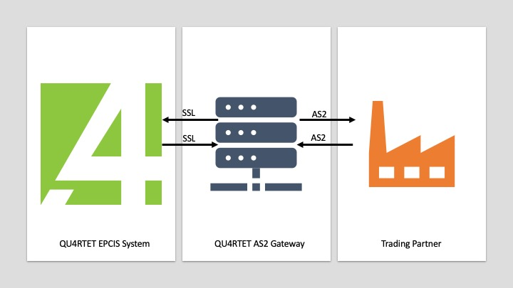

Overview
=========
The Gateway must have some information before it can effectively secure and route messages properly.
This document will explain provisioning a Trading Partner and a QU4RTET Server for use with the Gateway.

How the QU4RTET AS2 Gateway Works
~~~~~~~~~~~~~~~~~~~~~~~~~~~~~~~~~

The QU4RTET AS2 Gateway sits between a QU4RTET Server instance and a Trading Partner's System. The QU4RTET team will provision
the Trading Partner into the QU4RTET AS2 Gateway. The QU4RTET AS2 Gateway must know certain information about both QU4RTET and
the Trading Partner's System. Before attempting to setup the QU4RTET AS2 Gateway, have the following information available.

For QUARTET:
- QU4RTET Server Name
- QU4RTET REST API URL
- QU4RTET Public Certificate Key
- QU4RTET Private Certificate Key

For the Trading Partner:
-

Receiving Messages
~~~~~~~~~~~~~~~~~~
A Trading Partner will send an AS2 secured EPCIS Document to the QU4RTET AS2 Gateway at the endpoint: ``https://as2.qu4rtet.io/pyas2/as2receive``.
Upon reciept of the AS2 Message, the Gateway determines for which QU4RTET Server the AS2 Message is intended and routes
the AS2 Message to QU4RTET's REST API using Secured Sockets Layer (SSL).

Sending Messages
~~~~~~~~~~~~~~~~
QU4RTET sends AS2 messages by sending the message, e.g. an EPCIS Document, along with ``Sender`` and ``Receiver`` information, to the QU4RTET
AS2 Gateway endpoint: ``https://as2.qu4rtet.io/send``. The Gateway looks at the ``Sender`` and ``Receiver`` information and forwards the
AS2 Message to the correct endpoint managed by the Partner.

